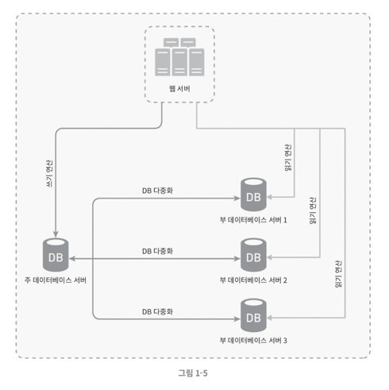

# 1장. 사용자 수에 따른 규모 확장성

## NoSQL이 바람직한 경우

- 아주 낮은 응답 지연시간(latency) 이 요구되는 경우
- 다루는 데이터가 비정형이라 관계형 데이터가 아닌 경우
- 데이터(JSON, XML emd)를 직렬화 하거나 역직렬화 할 수 있기만 하면 되는 경우,
- 아주 많은 양의 데이터를 저장할 필요가 있는 경우 <- ??

> 무조건 많은 양의 데이터를 저장할 경우 NoSQL이 더 좋은 판단일까?

## 수직적 규모 확장

`스케일 업(scale up)` 이라고 불리는 수직적 규모 확장은 서버에 고사양 자원을 추가하는 행위를 말한다.

**언제 스케일 업이 필요할까?**

- 서버로 유입되는 트래픽의 양이 적을 때 수직적 확장이 좋은 선택이 될 것이다.

**스케일 업의 단점은?**

- 한 대의 서버에 CPU, Memory 등의 자원을 무한으로 증설할 수는 없다.
- 서버에 장애가 발생했을 때 대응 방법인 자동복구, 다중화 방안을 제시하지 않는다. 즉, 완전히 중단된다.

주로 이러한 이유로 인해, 대규모 애플리케이션을 지원하는 데는 수평적 규모 확장법이 보다 적절하다.

> CKIN 프로젝트에서도 API 서버를 2대로 운영하고 health check 를 통해 서버 상태 확인 후, 문제가 발생한 서버를 제외하고 서비스를 제공하는 방식을 사용했다.

## 데이터베이스 다중화

Master-Slave 구조로 데이터베이스 다중화를 구성할 수 있다.

- Master: 쓰기 연산 지원 (insert, delete, update)
- Slave: 읽기 연산만을 지원 (read)

이러한 이유는 대부분의 애플리케이션은 읽기 연산의 비중이 훨씬 높기 때문이다.

**얻을 수 있는 이점**

1. 더 나은 성능: 병렬로 처리될 수 있는 쿼리의 수가 늘어나 성능이 좋아진다.
2. 안전성: 데이터베이스 서버 일부가 파괴되어도 데이터는 보존된다.
3. 가용성: 하나의 데이터베이스 서버에서 장애가 발생하더라도, 다른 데이터베이스로 대체할 수 있다.

## 무상태(stateless) 웹 계층

> 프로젝트에서 로그인은 JWT 토큰을 사용하여 사용자의 상태를 세션에 저장하지 않고,  
> 쿠키 또는 헤더에 토큰을 저장하여 사용자의 상태를 유지하는 방식을 사용했다.

위 사진과 같은 방식이 있다고 가정해보자.
사용자 A는 서버 1을 통해 로그인을 하였다. 이후에 서버 2로 요청을 보내면 어떤 일이 발생할까?

- 서버 2는 사용자 A의 로그인 상태를 알 수 없다.
- 사용자 A는 서버 1에 로그인 상태를 저장하고 있기 때문에 서버 1로 요청을 보내야 한다.

**수평적 규모 확장을 하게 된 경우라면 무상태 아키텍처로 설계하는 것이 좋다.**

- 공유 저장소를 통해 사용자 상태 정보는 웹 서버로부터 물리적으로 분리된다.
- 단순하고 안정적이며, 규모 확장이 쉽다.

> 주로 이러한 공유 저장소는 RDBMS, NoSQL 등을 사용한다.

**Q. 넷플릭스가 여러 데이터센터에 걸쳐 데이터를 어떻게 다중화하는걸까?**

## 메시지 큐

> 분산 시스템에서 시스템의 컴포넌트를 분리하여, 각기 독립적으로 확장할 수 있도록 채용하고 있는 핵심적 전략 가운데 하나

- 메시지의 무손실을 보장하는 비동신 통신을 지원하는 컴포넌트
  - 무손실: 보관된 메시지는 소비자가 꺼낼 때 까지 안전히 보관된다.

**메시지 큐 아키텍처**
- 생산자/발행자 (Producer/Publisher): 메시지를 만들어 메시지 큐에 발행(publish) 한다.
- 소비자/구독자 (Consumer/Subscriber): 메시지를 받아 그에 맞는 동작을 수행하는 역할을 한다.

**메시지 큐의 장점**
- 서비스 또는 서버 간의 결합도가 낮아진다. 
  - 이는, 규모 확장성이 보장되어야 하는 안정적 애플리케이션을 구성하기 좋다.
- 생산자, 소비자 둘 중 하나에서 장애가 발생하더라도, 다른 쪽에서 메시지를 처리할 수 있다.

## 정리

시스템 규모 확장을 위해 살펴본 기법들을 정리하면 다음과 같다.

- 웹 계층은 무상태(stateless) 계층으로
- 모든 계층에 다중화 도입
- 가능한 한 많은 데이터를 캐시할 것 
- 여러 데이터 센터를 지원할 것
- 정적 콘텐츠는 CDN을 통해 서비스할 것
- 데이터 계층은 샤딩을 통해 그 규모를 확장할 것
- 각 계층은 독립적 서비스로 분할할 것
- 시스템을 지속적으로 모니터링하고, 자동화 도구를 활용할 것

> 위와 같은 기법들이 왜 필요한지, 장점은 무엇인지 다른 사람에게 설명해보기 