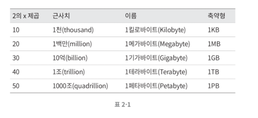
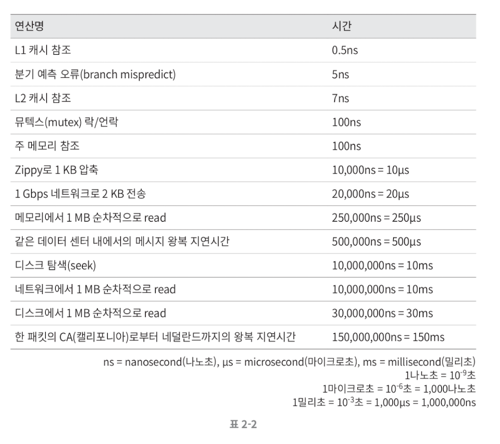

# 2장. 개략적인 규모 추정

시스템 용량이나 성능 요구사항을 개략적으로 추정해보라는 요구를 받았을 때

- 규모 확장성을 표현하는데 필요한 기본기에 능숙해야 함.
- 특히, 2의 제곱수나 응답지연(latency) 값, 가용성에 관계된 수치들을 이해하고 있어야 함.

## 2의 제곱수

## 응답지연 값

**알아둬야 할 내용**

- 메모리는 빠르지만 디스크는 아직도 느리다.
- 디스크 탐색(seek)은 가능한 한 피하라.
- 단순한 압축 알고리즘은 빠르다.
- 데이터를 인터넷으로 전송하기 전에 가능하면 압축하라.
- 데이터 센터는 보통 여러 지역(region)에 분산되어 있고, 센터들 간에 데이터를 주고받는 데 시간이 걸린다.

## 가용성 수치

고가용성(high availability)은 시스템이 오랜 시간동안 지속적으로 중단 없이 운영될 수 있는 능력

- 고가용성 100% : 시스템이 단 한번도 중단된 적이 없었음을 의미한다.
- 대부분의 서비스는 99% ~ 100% 사이의 값을 가진다.

> 내용에 대해서 정확하게 이해하기가 어렵다.   
> 이러한 내용을 아직 고려하며 시스템을 설계해본 경험이 없어서 그런가?