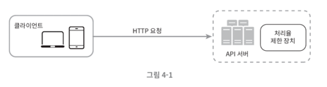
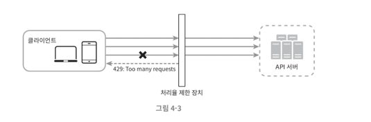
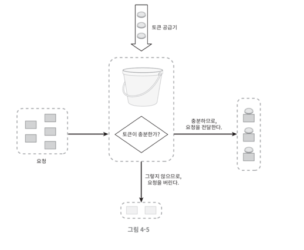
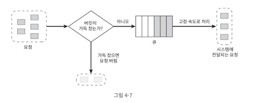
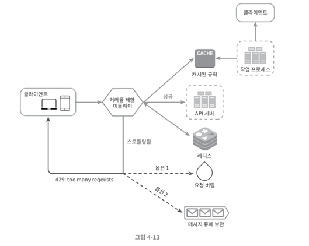

# 4장. 처리율 제한 장치의 설계

> **처리율 제한 장치(rate limiter)**: 네트워크 시스템에서 클라이언트 또는 서비스가 보내는 트래픽의 처리율(rate)을 제어하기 위한 장치

대표적인 사례는 다음과 같다.

- 초당 2회 이상 새 글을 올릴 수 없다.
- 같은 IP 주소로 하루에 10개 이상의 계정을 만들 수 없다.
- 같은 디바이스로는 주당 5회 이상 리워드를 요청할 수 없다.

들어가기 전, 위와 같은 제한을 통해 얻는 이득은 무엇일까?

### 처리율 제한 장치의 장점

- DoS(Denial of Service) 공격에 의한 자원 고갈을 방지할 수 있다.
- 비용을 절감한다.
- 서버 과부하를 막는다.

추가 요청에 대해 처리를 중단함으로써 DoS 공격을 방지하거나, 서드파티 API에 사용료를 지불하거나, 봇에서 오는 트래픽이나 사용자의 잘못된 이용패턴으로 유발된
트래픽을 제한함으로써 위와 같은 효과를 얻는 것이다.

이제 처리율 제한 장치를 설계하는 순서에 대해 알아보자.

## 문제 이해 및 설계 범위 확정

항상 어떤 문제를 해결하기 위해서는 문제를 정확하게 이해하고, 설계의 범위를 확정지어야 한다.

클라이언트-서버 통신 모델인 경우, 어디에서 제한을 해야하는지, 어떤 기준으로 제어를 해야하는지, 시스템 규모 등을 파악하자.

## 개략적 설계안 제시 및 동의 구하기

> 기본적인 클라이언트-서버 통신 모델을 생각해보자.

### 처리율 제한 장치는 어디에 존재해야 할까?

**클라이언트**

- 클라이언트 요청은 쉽게 **위변조가 가능한 점** 때문에 처리율 제한을 안정적으로 걸 수 없다.
- 또한, 모든 클라이언트의 구현을 통제하는 것도 어려울 수 있다.

**서버**

**미들웨어**

- MSA 환경의 API Gateway 컴포넌트로 구현이 될 수 있다.
- 즉, 분산 환경에서 적용할 수 있는 방법이다.

위의 3가지 중 정답은 없기 때문에 상황에 따라 선택해야 한다.

### 처리율 제한 알고리즘

> 널리 알려진 인기 알고리즘을 개략적으로만 알아보자.

**토큰 버킷 알고리즘**

- 토큰 버킷: 지정된 용량을 갖는 컨테이너
- 토큰 공급기(refiller): 일정 시간동안 토큰을 추가, 버킷이 가득찬 경우 토큰은 버려진다.

각 요청이 도착하면 버킷에 충분한 토큰이 있는지 검사한 후 처리될 때 하나의 토큰을 사용한다.

전체적인 흐름을 그림으로 보자면 다음과 같다.

_공급 제한 규칙에 따라 달라지는 사례들_

- API 엔드포인트마다 별도의 버킷을 사용한다.
- IP 주소마다 버킷을 하나씩 할당한다.
- 시스템의 처리율을 초당 제한한다면, 모든 요청이 하나의 버킷을 공유한다.

> 구현이 쉽고, 메모리 사용 측면에서도 효율적이며 트래픽 몰림 현상도 처리할 수 있지만,  
> 버킷의 크기와 토큰 공급률을 적절하게 튜닝하기 어렵다는 단점이 존재한다.

**누출 버킷 알고리즘**

- 토큰 버킷 알고리즘과 유사하지만, 요청 처리율이 고정되어있다는 점이 다르다.
- 큐를 사용하기 때문에, 안정적인 처리를 할 수 있다.

> 단 시간에 많은 트래픽이 몰리는 경우, 큐에는 오래된 요청이 쌓여 최신 요청이 계속 버려지게 되는 문제가 있다.

더 많은 알고리즘이 있지만, 이후에 따로 공부하도록 하자.

## 상세 설계

> Redis의 INCR, EXPIRE 명령어를 통해 처리율 제한을 구현한 아키텍처

1. 클라이언트 요청을 처리율 제한 미들웨어(Gateway)가 받는다.
2. 미들웨어는 제한 규칙을 캐시에서 가져오며, 카운터 및 마지막 요청 시간을 가져온다.
3. 제한에 걸려있지 않을 경우 API 서버로 요청을 보내고, 제한에 걸렸다면 429 too many request 에러를 클라이언트 측으로 보낸다ㅏ.

### 만약, 분산 환경이라면? 

위의 예시는 단일 서버의 예시이지만, 분산 서버일 경우 **경쟁 조건**, **동기화** 문제를 풀어야 한다.

- 경쟁 조건 문제 해결을 위해 락을 사용할 수 있지만, 시스템 성능을 상당히 떨어뜨린다는 문제가 존재한다.
  - 락을 사용하지 않는다면, 루아 스크립트, Sorted Set을 사용하는 방법이 존재한다 &rarr; 이 방식은 별도로 찾아보자.
- 동기화 문제를 해결하기 위해 고정 세션(sticky session)을 활용하여 항상 같은 처리율 제한 장치로 보낼 수 있다.
  - 하지만, 규모면에서 확장 가능하지도 않고, 유연하지도 않아 권장되지 않는다.

---

## 느낀점

책을 읽으면서 정말 다양한 상황을 고려해야 한다는 점을 계속해서 배우고 있다.  
특히, 경쟁 상태와 동기화 이슈에 대해서는 더 공부해볼만한 가치가 있어보인다. 작은 시스템을 구축하더라도 중요한 부분이라고 매번 느끼는 중,,

또한, Redis를 통해 처리율 제한 장치를 구현하는 방법을 보면서 분산 락과 유사하다는 점이 인상깊었다. 하나의 기술로 여러 문제를 해결한다는 것을 보고 역시 기본적인 원리를 이해하고 다양한 상황에 적용할 수 있는 능력은 필수적인 것 같다.