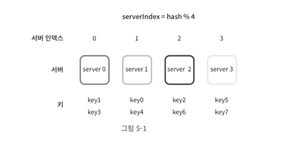
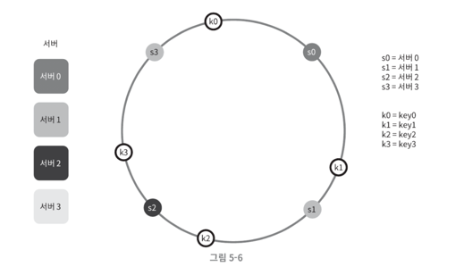

# 5장. 안정 해시 설계

스케일 아웃을 통한 수평적 규모 확장성을 달성하기 위해 서버에 균등하게 요청을 분배하는 것이 중요하다.

이 때, 안정 해시라는 보편적 기술을 사용하여 해결한다고 하는데 문제에 대해서 먼저 알아보자.

## 해시 키 재배치(rehash) 문제

보통 다음과 같은 해시 함수를 사용하여 분배한다.

- key: 데이터를 식별할 수 있는 고유 식별자
- N: 서버의 개수

```markdown
serverIndex = hash(key) % N
```



위 사진과 같이 서버 풀의 크기가 고정되어 있으며 데이터 분포가 균등할 때는 잘 작동한다.

**문제가 되는 상황**

- 서버가 추가되거나
- 기존 서버가 삭제된다면?

예를 들어 1번 서버가 장애를 일으켜 중단했다면 서버 풀의 크기가 3으로 줄어든다.  
이러한 상황에선 키가 재분배 되어 대규모 캐시 미스가 발생하게 된다. 

> 안정 해시는 이러한 문제를 해결하는 방법이다.

## 안정 해시

안정 해시: 해시 테이블 크기가 조정될 때 평균적으로 오직 k/n개의 키만 재배치하는 해시 기술 (말이 어렵다..)

- k: 키의 개수
- n: 슬롯(slot)의 개수

거의 전통적 해시 테이블은 슬롯의 수가 바뀌면 대부분 키를 재배치한다는 점과는 차별점이 존재한다.



위 사진과 같이 해시 링(hash ring)을 만들어 서버를 배치하고 키를 저장한다.
(이 때, 나머지 연산은 사용하지 않는다.)

### 서버 조회

- 키의 위치로부터 시계 방향으로 링을 탐색해 나가면서 만나는 첫 번째 서버에 키가 저장되게 된다.

### 서버 추가

서버를 추가하더라도 키 가운데 일부만 재배치하면 되는 것이다.

- 즉, 시계 방향으로 순회했을 때 처음 만나게 되는 서버가 변경되는 키만 재배치하면 된다.
- 다른 키들은 재배치가 필요 없다.

### 서버 제거

서버 제거도 마찬가지로 서버를 제거한 후 시계 방향으로 순회했을 때 처음 만나게 되는 서버로 키를 이동시키면 된다.

- 다른 나머지 키에는 영향이 없는 것을 알 수 있다.


> 자연스럽게 드는 의문은, 한 쪽으로 쏠리는 현상이 발생하지 않을지 의문이 들 것이다.

### 안정 해시 알고리즘의 문제점

1. 파티션(partition)의 크기가 서버 추가 및 삭제 상황에서 불균형해지는 문제가 있다.
2. 키의 균등 분포(uniform distribution)를 달성하기 어렵다.

이러한 문제를 해결하기 위해 **가상 노드(virtual node)** 또는 **복제(replica)** 라고 불리는 기법을 사용한다.

### 가상 노드

쉽게 설명하자면, 1개의 노드가 아닌 여러 개의 가상 노드를 통해 링에 배치하여 여러 파티션을 관리하는 기법이다.

- 가상 노드의 개수를 늘리면, 키의 분포는 점점 균등해진다.
- 그러나 가상 노드 데이터를 저장할 공간은 더 많이 필요하게 될 것이다. (trade-off)

---

## 느낀점

해시 기술을 사용해서 서버에 균등하게 요청을 분배하는 방법을 알게 되었다.

실제로는 어떻게 적용을 하고, 구현은 어떻게 되어있는지 궁금증이 생김!
&rarr; 디스코드 서버에서도 이러한 기술을 사용한다고 했는데 한 번 찾아봐야겠다.

또한, 자바에서 해시를 사용하는 경우에 해시 불균형이 발생하는 상황도 있을 것 같은데 이에 대한 대응책은 무엇이 있을지도 궁금해짐 