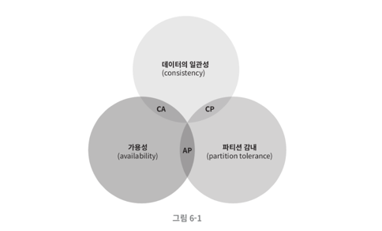
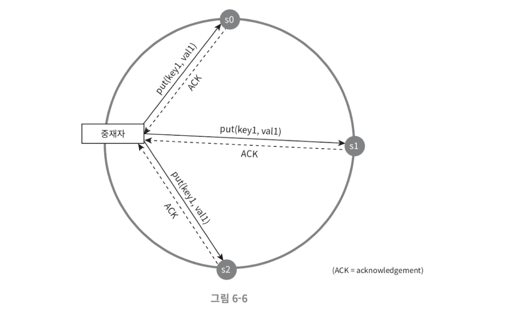

# 6장. 키-값 저장소 설계

> 고유 식별자(identifier)를 키로 가지는 키-값 저장소는 비 관계형 데이터베이스이다.

다음과 같은 연산을 지원하는 키-값 저장소를 설계해보자.

- put(key, value): 키-값 쌍을 저장소에 저장한다.
- get(key): 인자로 주어진 키에 해당하는 값을 반환한다.

## 단일 서버 키-값 저장소

키-값 쌍을 전부 메모리에 **해시 테이블** 로 저장하는 방법은 어떨까?

- 빠른 속도를 보장한다.
- 하지만, 모든 데이터를 메모리 안에 저장하는 것은 불가능할 수도 있다.

데이터 압축, 자주 쓰는 데이터만 메모리에 저장하고 나머지는 디스크에 저장하는 방식 등 개선책이 존재하지만, 여전히 한 대 서버로 부족한 때가 찾아올 것이다.

이로 인해, 분산 키-값 저장소를 만들 필요가 있는 것이다.

## 분산 키-값 저장소

키-값 쌍을 여러 서버에 분산시켜 **분산 해시 테이블** 이라고도 불린다.

### CAP 정리 (Consistency, Availability, Partition Tolerance theorem) 이란?

분산 시스템을 설계하기 전에 CAP 정리를 이해해야 하는데 **데이터 일관성(Consistency)**, **가용성(Availability)**, **파티션 감내(partition tolerance)** 라는 
3가지 요구사항을 동시에 만족시키는 것은 불가능하다는 정리다.

> - 일관성(Consistency): 분산 시스템에 접속하는 모든 클라이언트에게 항상 같은 데이터를 보여줘야 한다.
> - 가용성(Availability): 분산 시스템에 접속하는 클라이언트는 일부 노드에 장애가 있더라도 항상 응답을 받아야 한다.
> - 파티션 감내(Partition Tolerance): 네트워크에 파티션(두 노드 상에 장애가 발생)이 생기더라도 시스템은 계속 동작하여야 한다.

위 그림처럼, 어떤 두 가지를 충족하기 위해서는 반드시 하나는 희생되어야 한다는 것을 의미한다.

이상적인 환경이라면 네트워크가 파티션되는 상황은 일어나지 않을 것이며, 데이터 일관성과 가용성 또한 만족할 것이다.

하지만, '분산 시스템'은 파티션 문제를 피할 수 없다. 이러한 상황에서 우리는 일관성을 지킬 것인지, 가용성을 지킬 것인지 선택해야 한다.

- 일관성을 선택한 시스템: 데이터 불일치를 피하기 위해 정상적인 서버에 대해 쓰기 연산을 허용하지 않는다.
- 가용성을 선택한 시스템: 오래된 데이터를 반환할 위험이 있더라도 계속 읽기 연산을 허용한다.

### 데이터 파티션

가장 단순한 해결책은 데이터를 작은 파티션들로 나누어 여러 서버에 저장하는 것이다. 

- 데이터를 여러 서버에 고르게 분산할 수 있는가
- 노드가 추가되거나 삭제될 때 데이터 이동을 최소화 할 수 있는가

5장의 안정 해시(consistent hash)는 이러한 문제 해결에 적합한 기술이다.

- 안정 해시를 통해 데이터를 파티션한다면 규모 확장 자동화, 다양성이라는 장점을 얻을 수 있다.

### 데이터 다중화

데이터를 N개의 서버에 비동기적으로 다중화(복제)하는 방법을 말한다.

- N개 서버에 데이터 사본을 저장하게 되는데, 이 때 안정 해시를 사용하면 키가 만나는 첫번째 서버로부터 연속적인 일정 갯수의 서버에 같은 데이터를 저장할 수 있다.

### 데이터 일관성

여러 노드에 다중화된 데이터는 적절히 동기화 되어야 한다.

> 정족수 합의(Quorum Consensus) 프로토콜을 사용하여 일관성을 보장할 수 있다.

- N = 사본 개수
- W = 쓰기 연산에 대한 정족수; W개의 서버로부터 응답을 받아야 성공
- R = 읽기 연산에 대한 정족수; R개의 서버로부터 응답을 받아야 성공

_example_

N = 3인 정족수 합의 프로토콜을 예로 들어보자.

> 중재자(coordinate)는 클라이언트와 노드(서버) 사이의 Proxy 역할을 하며, 노드가 중재자가 되는 경우도 있다.

- W = 1: 중재자는 1개 노드의 쓰기 응답을 받으면 되기 때문에 쓰기 속도가 빠르다.
- R = 1: 중재자는 1개 노드의 읽기 응답을 받으면 되기 때문에 읽기 속도가 빠르다.

이러한 특징을 이용하여 요구되는 일관성 수준에 따라 W, R, N 값을 조정하자.

- R = 1, W = N: 빠른 읽기 연산에 최적화된 시스템
- W = 1, R = N: 빠른 쓰기 연산에 최적화된 시스템
- W + R > N: 강한 일관성 보장 
- W + R <= N: 강한 일관성이 보장되지 않음. (약한 일관성)

여기서 말하는 **강한 일관성**, **약한 일관성** 에 대해 살펴보자.

#### 일관성 모델

1. 강한 일관성 
   - 모든 사본에 쓰기 연산이 반영될 때까지 읽기/쓰기를 못한다.
   - 즉, 클라이언트는 오래된 데이터를 읽을 수 없음.
   - 가용성이 낮아 고가용성 시스템에 적합하지 않음.
2. 약한 일관성
   - 가장 최근에 갱신된 결과를 반환하지 못할 수 있음.
   - 고가용성이 요구되는 시스템에 적합
3. 최종 일관성
   - 쓰기 연산이 병렬적으로 발생하면 일관성이 깨질 수 있음. &rarr; 클라이언트 측에서 해결해야 함.
   - 최종적으로 갱신 결과가 모든 사본에 동기화되어야 함.
   - 다이나모 DB, 카산드라가 해당 모델을 사용함.

#### 비일관성 해소 기법

> 이 방식은, Optimistic Lock 방식, DB Isolation Level 에서 본 것 같은데?

비 일관성 해소 기법으로 **데이터 버저닝** 을 사용할 수 있다.

#### 장애 감지

> 이것도 Service Discovery, Health Check 방식을 통해 Spring Cloud 에서 적용이 되었던 것 같음.

모든 노드 사이에 멀티캐스팅 채널을 구축하는 것이 손쉬운 방법이지만, 서버가 많을 때는 비효율적이다.

**가십 프로토콜 같은 분산형 장애 감지 솔루션을 사용하자.**

- Health Check 를 통해 주기적으로 Heartbeat 카운터를 증가
- Heartbeat 카운터가 일정 시간동안 증가하지 않으면 해당 노드는 장애로 간주

#### 일시적 장애 처리

어떤 정족수 시스템을 사용하고 있냐에 따라 필요한 조치를 취해야 한다.

- 엄격한 정족수: 데이터 일관성을 위해 읽기와 쓰기 연산을 금지
- 느슨한 정족수: 정족수 요구사항을 강제하는 대신, 쓰기 연산을 수행할 W개의 노드, 읽기 연산을 수행할 R개의 노드를 해시 링에서 선택 (장애 서버는 무시한다.)

임시로 쓰기 연산을 처리한 서버는 그에 관한 단서(hint)를 남겨두어, 장애가 해결되면 해당 서버에 쓰기 연산을 수행한다.

이러한 방식을 **단서 후 임시 위탁(hinted handoff)** 기법이라 부른다.

#### 영구 장애 처리

반-엔트로피(anti-entropy) 프로토콜을 사용하여 사본들을 동기화하자.

- 머클(Merkle) 트리를 사용하여 일관성 상태를 탐지하고 전송 데이터의 양을 줄인다.

> 시스템 아키텍처 다이어그램은 이미지를 보면서 이해하는게 좋을 것 같다.

---

### 느낀점

여태까지 사용했던 기술들에서도 이러한 원리를 바탕으로 구현, 설계가 되어있는 것을 알 수 있었다.  

정말 '왜 이렇게, 어떤 이유로 이렇게 구현이 되어있던걸까?' 라는 고민을 하는 자세가 필요한 것 같다.   
그냥 무작정 기술이 지원해주더라~ 라는 생각으로만 사용했던 모습이 조금 부끄럽네 ㅎㅎ;  
