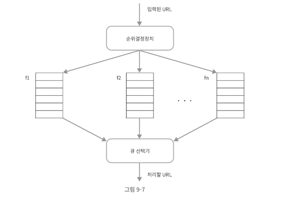

# 9장. 웹 크롤러 설계

- 로봇(robot) 또는 스파이더(spider)라고도 불린다.
- 검색 엔진에서 널리 쓰는 기술이며 웹에 새로 올라오거나 갱신된 컨텐츠를 찾는 것이 목적

### 크롤러 이용 예시

- 검색 엔진 인덱싱 (search engine indexing)
- 웹 아카이빙 (web archiving)
- 웹 마이닝 (web mining)
- 웹 모니터링 (web monitoring)

## 웹 크롤러의 기본 알고리즘

1. URL 집합이 입력으로 주어진다.
2. 해당 URL들이 가리키는 모든 웹 페이지를 다운로드한다.
3. 다운받은 웹 페이지에서 URL들을 추출
4. 추출된 URL들을 다운로드할 URL 집합에 추가 
5. 2번으로 돌아가 반복

이 때, 다음과 같은 속성에 주의를 기울이는 것도 중요하다:

- 규모 확장성: 수십억 개의 페이지가 존재하는 웹에서 **병행성(parallelism)** 을 통해 효과적인 크롤링 가능
- 안정성(robustness): 반응이 없는 서버, 장애, 악성코드 등 다양한 함정에 대응할 수 있어야 한다.
- 예절(politeness): 수집 대상 웹 사이트에 짧은 시간동안 많은 요청을 보내지 않도록 설계
- 확장성(extensibility): 새로운 형태의 컨텐츠를 지원하기 쉬워야 함

## 웹 크롤러 작업 흐름

### 1. 시작 URL 집합

웹 크롤러가 크롤링을 시작하는 출발점이다.

시작 URL을 선정하는 방법에는 답이 없다. 아래의 방법을 고려하자:

1. 전체 웹을 크롤링해야 하는 경우
   - 가능한 한 많은 링크를 탐색할 수 있도록 해야함
   - 일반적으로, 전체 URL 공간을 작은 부분집합으로 나누는 전략 사용
2. 주제별로 다른 URL 집합을 사용하는 경우
   - URL 공간을 주제별로 세분화하고 각각 다른 시작 URL을 사용

### 2. 미수집 URL 저장소

- 다운로드할 URL, 다운로드된 URL 두 가지로 나눠 관리하는 저장소
- FIFO 큐의 구조

### 3. HTML 다운로더 - 도메인 이름 변환기

- URL을 받아서 대응되는 IP 주소를 알아낸다.

### 4. 컨텐츠 파서

- 다운로드된 웹 페이지에 대해 파싱(parsing) 및 검증(validation) 절차 수행
- 올바른 웹 페이지인지 확인하는 과정을 거친다.

### 5. 중복 컨텐츠 처리 

- 웹의 29% 정도가 중복된 컨텐츠
- 중복된 웹 페이지를 저장하지 않도록 해시 값 비교를 사용

**컨텐츠 저장소** 

- HTML 문서 보관소
- 데이터 양이 많아 디스크에 저장하고, 인기있는 컨텐츠는 메모리에 저장

### 6. URL 추출기

- HTML 페이지를 파싱하여 링크(href) 추출
- 상대 경로를 절대 경로로 변환

### 7. URL 필터

- 특정 컨텐츠 타입이나 파일 확장자를 갖는 URL
- 접속시 오류가 발생하는 URL
- 접근 제외 목록에 포함된 URL

위와 같은 배제되어야 할 URL을 걸러낸다.

### 8. 이미 방문한 URL 처리

- 이미 방문한 적 있는 URL에 대해 처리하여 부하 및 무한 루프를 방지한다.
- 주로 블룸 필터(bloom filter)나 해시 테이블을 통해 처리

### 9. URL 저장

- 이미 방문한 URL을 보관한다. 
- 또한, 미수집 URL 저장소에도 해당 URL을 추가한다.

## 상세 설계

### DFS? BFS?

웹은 유향 그래프(directed graph)이다. 페이지는 노드, URL은 에지로 보면 된다.

DFS(깊이 우선 탐색)은 그래프 크기가 클 경우 어느 정도로 깊숙이 가게 될지 가늠하기 어렵다. 따라서 좋은 선택이 아닐 가능성이 높다.

따라서, 웹 크롤러는 보통 BFS(너비 우선 탐색)을 사용한다. BFS는 FIFO 큐를 사용하는 알고리즘이다.

**BFS에는 문제점은 없을까?**

- URL들을 병렬로 처리할 경우 같은 서버에 대한 요청이 많아질 수 있어 '예의 없는(impolite)' 크롤러로 간주될 수 있다.
- BFS 방식은 URL 간 우선순위를 두지 않아 페이지 순위, 사용자 트래픽 양 등 여러 척도에 대해 고려하지 않는다.

이러한 문제는 미수집 URL 저장소로 쉽게 해결할 수 있다.

### 미수집 URL 저장소

URL 사이의 우선순위와 신선도(freshness)를 구별하는 크롤러를 구현할 수 있다.

**예의**
- 웹 크롤러는 수집 대상 서버에 짧은 시간 동안 많은 요청을 보내지 않도록 해야 한다.
- 이러한 경우, DoS 공격으로 간주되어 차단될 수 있다.
- 동일 웹 사이트에 대해 한 번에 한 페이지만 요청하도록 제한하자. 
- 웹 사이트 호스트명(hostname)과 다운로드를 수행하는 작업 스레드 사이의 관계를 유지해 구현한다.

- 큐 라우터: 같은 호스트에 속한 URL은 같은 큐(b1, b2, ..., bn)로 가도록 보장
- 매핑 테이블: 호스트 이름과 큐 사이의 관계를 보관하는 테이블
- FIFO Queue(b1 ~ bn): 같은 호스트에 속한 URL은 언제나 같은 큐에 보관
- 큐 선택기: 큐를 순회하여 나온 URL을 작업 스레드에 전달하는 역할
- 작업 스레드: 전달된 URL 다운로드 수행. 순차적으로 처리

**우선순위**

유용성에 따라 URL의 우선순위를 나눌 때 페이지랭크, 트래픽 양, 갱신 빈도 등 다양한 척도 사용

- 순위결정장치: URL의 우선순위 계싼
- 큐(f1 ~ fn): 우선순위별로 큐가 하나씩 할당. 
- 큐선택기: 높은 우선순위를 가진 큐에서부터 URL을 꺼내는 역할

위의 두 큐를 합쳐, 전면 큐에서는 우선순위 결정 과정을 처리하고, 후면 큐에서 크롤러가 예의 바르게 동작하도록 보장한다.

**신선도(freshness)**

웹 페이지는 매번 추가, 수정, 삭제되기 때문에 데이터의 신선도를 위해 재수집할 필요가 있다.

- 웹 페이지의 변경 이력을 확인한다.
- 우선순위를 활용하여, 중요한 페이지는 수집 빈도를 높인다.

### HTML 다운로더

**Robots.txt**

- 크롤러가 수집해도 되는 페이지 목록이 들어있다.

**성능 최적화**

1. 분산 크롤링
   - 여러 서버에 크롤링 작업을 분산하고, 각 서버는 여러 스레드를 돌려서 처리
2. 도메인 이름 변환 결과 캐시
   - DNS 요청이 병목 중 하나 (10ms ~ 200ms)
   - 조회 결과를 캐시에 보관
   - 크론 잡(cron job) 등을 돌려 주기적으로 갱신
3. 지역성
   - 크롤링 작업을 여러 서버에 분산
   - 지역성은 크롤 서버, 캐시, 큐, 저장소 등에 적용 가능
4. 짧은 타임아웃
   - 대기 시간이 길어지는 것을 방지

**안정성**

- 안정 해시
- 크롤링 상태 및 수집 데이터 저장
- 예외 처리
- 데이터 검증

**확장성**

이러한 시스템을 설계할 때는 새로운 형태의 컨텐츠를 쉽게 지원할 수 있도록 신경써야 한다.

- PNG 다운로더
- 웹 모니터

위와 같은 새로운 기능을 추가한다면?

**문제 있는 컨텐츠 감지 및 회피**

1. 중복 컨텐츠
2. 거미 덫
3. 데이터 노이즈

---

생각보다 내용이 되게 깊다. (DFS가 아닌 BFS를 쓴다매 왜케 깊게 들어가는거야...)

단순히 파이썬으로 크롤링하는 것을 떠올렸는데, 생각보다 체계적인 시스템을 갖추고 웹 크롤러를 설계한다는 것은 어려운 것을 느꼈다. 
그리고, 다루는 내용들이 많아 한 번에 이해하기 어려운 내용들도 많았다. 
