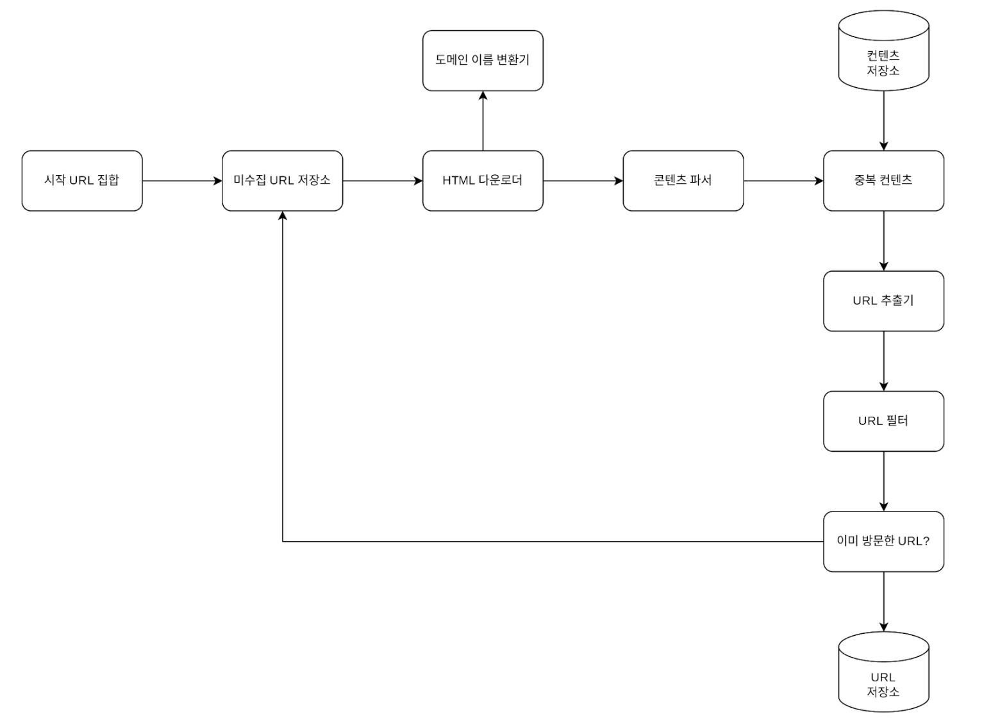

# 9장. 웹 크롤러 설계

## 크롤러 종류
- 검색 엔진 인덱싱 : 검색 엔진에서 웹 페이지 검색을 위해 사용하는 웹 크롤러이다. 
- 웹 마이닝 : 데이터를 분석해서 정보를 추출하는 웹 크롤러이다.

## 고려할 점
- 규모 확장성 : 웹은 수십억 개의 페이지가 존재한다. 따라서 크롤링에 병행성을 활용하는 것이 효과적인 것이다.
- 안정성 : 웹은 방대한만큼 함정이 가득하다. 잘못 작성된 HTML, 아무 반응이 없는 서버, 악성코드가 있는 링크 등이 그 좋은 예이다. 그렇기 때문에 이 부분에 잘 대응할 수 있어야 한다.
- 예절(번역이 예절로 되어 있는데 뭔가 어색하다) : 크롤러는 요청을 통해 사이트 정보를 받게 되는데 짧은 시간동안 많은 요청을 보내면 DOS공격으로 생각할수도 있으므로 설계를 잘해야 한다.
- 확장성 : 현재 크롤링하고 있는 컨텐츠에 추가적으로 다른 컨텐츠도 크롤링하고 싶을 때 기능 추가가 쉬워야 한다.

## 웹 크롤러 작업 구조

### 1. 시작 URL 집합
크롤링의 시작하는 출발점이다.   
크롤러는 가능한 많은 링크를 탐색해야 하므로 전체 URL 공간을 부분집합으로 나누어 병렬적으로 탐색을 시작한다.  
시작점을 무엇으로 정할지에 대한 정답은 없다.

### 2. 미수집 URL 저장소
크롤링 상태는 다운로드할 URL, 다운로드 된 URL 두 가지로 나눠 관리한다.  
이 중 다운로드할 URL이 미수집 URL 저장소(URL frontier)이다.  
큐라고 생각하면 된다. 처리하는 속도가 다를 수 있으므로 이 방식이 합리적이다.

### 3. HTML 다운로더
웹 페이지를 다운로드하는 곳이다. 다운로드할 페이지의 URL은 미수집 URL 저장소가 제공한다.

### 4. 도메인 이름 변환기
도메인 이름은 사람이 알기 쉽게 변환해 놓은 형태이므로 다시 IP주소로 변환하는 절차가 필요하다.  
그 작업을 여기서 진행한다.

### 5. 콘텐츠 파서
웹 페이지를 다운로드할 때 올바른 웹 페이지인지 확인하는 절차를 콘텐츠 파서에서 진행한다.

### 6. 콘텐츠 저장소
- 데이터 양이 많으므로 대부분의 콘텐츠는 디스크에 저장한다.
- 대신 인기있는 콘텐츠는 메모리에 두어 접근 지연시간을 줄인다.
- 콘텐츠 파서에선 넘어오는 웹 페이지에서 중복되는 콘텐츠는 버리고 새로운 콘텐츠만 저장한다.
- 문자열로 비교하기 보다는 해시 값을 통해서 비교하도록 하자. 왜냐하면 모든 콘텐츠를 일일이 비교하기에는 느리고 비효율적이기 떄문이다.

### 7. URL 추출기
HTML페이지를 파싱하여 링크들만 골라낸다.

### 8. URL 필터
올바르지 못한 링크들을 걸러내는 역할을 한다.

### 9.URL 저장소
이미 방문한 URL과 그렇지 않은 URL을 구분하여 처음 방문한 URL만 저장소에 저장한다.

## 상세 설계

### DFS를 쓸 것인가? BFS를 쓸 것인가?
웹은 유향 그래프이다. 한 페이지에서 링크를 통해 다른 페이지로 연결되기 때문이다.  
여기서 크롤링하는 방법으로는 DFS와 BFS 중 하나를 선택할 수 있는데 DFS는 좋은 방법이 아니다.  
그래프 크기가 크다면 얼마나 깊게 들어갈지 모르기 떄문이다.  
그렇다고 해서 BFS를 사용하기에도 문제가 있다.  
BFS는 URL간 우선순위를 두지 않고, 하나의 페이지는 그 안에 같은 호스트의 같은 페이지를 링크로 갖고 있는 경우가 많기 때문에 impolite 크롤러로 간주된다.

### 미수집 URL 저장소 
동일 웹사이트에 대해서 한 번에 한 페이지만 요청하게 해서 Dos공격으로 간주 받는 것을 방지할 수 있다.

### HTML 다운로더
Robot.txt를 통해 웹사이트에서 수집해도 되는 컨텐츠를 확인할 수 있다.

## 성능 최적화

### 분산 크롤링
크롤링 작업을 여러 서버에 분산하고 각 서버는 여러 스레드를 돌려 다운로드 작업을 처리한다.

### 도메인 이름 변환 결과 캐시
DNS 요청이 처리되는 데는 보통 10ms ~ 200ms까지 소요된다. 그렇기 떄문에 병목지점이 될 수 있다.   
따라서 DNS 조회 결과로 얻어진 도메인 이름과 IP주소 사이의 관계를 캐시에 보관해두고 cron job을 돌려 주기적으로 갱신해놓으면 성능을 올릴 수 있다.

## 지역성
서버를 지역별로 분산해서 페이지 다운로드 시간을 줄인다.  
이 전략은 크롤링서버, 캐시, 큐, 저장소 등 대부분의 컴포넌트에 적용가능하다.

## 짧은 타임아웃
어떤 웹 서버는 응답이 느리거나 아예 응답하지 않으므로 이런 경우 대기시간을 정해두고 페이지 다운로드를 중단하고 다음 페이지로 넘어간다.

## 생각
> 크롤러에 대한 지식은 거의 없다고 봐도 무방하다.
> 최근에서야 블로그 글이 검색되는 원리에 대해 알게 되고, 채용 공고들을 수집해서 정보를 알려주는 사이트를 알게 돼서 웹 크롤링은 이런 곳에서 사용할 수 있다는 정도만 알고 있다.  
> 그래서 이번 장은 내용들이 생소한 것 같다. 나중에 언젠가 만들어볼 기회가 있을 때 이 부분을 다시 읽어봐야겠다.