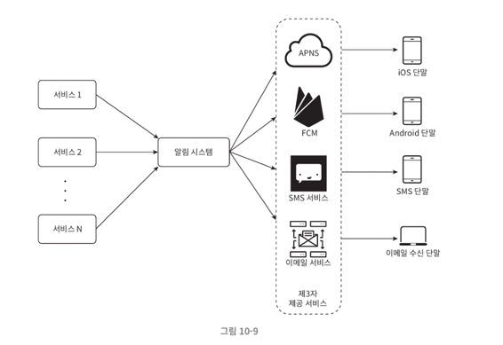
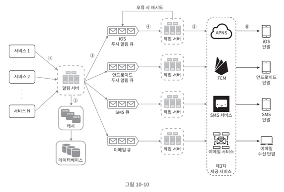

# 10장. 알림 시스템 설계

알림 시스템(notification system)은 고객에게 중요할 만한 정보를 비동기적으로 제공한다.

_알림 시스템의 종류_

- 모바일 푸시 알림
- SMS 메시지
- 이메일 

아래의 예시들로 알림 시스템은 어떻게 동작하는지, 어떻게 설계하는지 파악해보자.

## 알림 유형별 지원 방안

### 모바일 푸시 알림

- 알림 제공자(provider)
- 푸시 알림 서비스(iOS: APNs, 안드로이드: FCM)
- 단말기

위와 같은 컴포넌트들로 구성되며, 알림 제공자는 아래와 같은 알림 요청(notification request)을 만들어 푸시 알림 서비스에 전달한다.

```json
{
  "aps": {
    "alert": "Game Request",
    "body": "Bob wants to play chess",
    "action-loc-key": "PLAY"
  },
  "badge": 5
}
```

### SMS 메시지

SMS 메시지는 제3자 서비스인 SMS 서비스를 많이 이용하며 대부분 상용 서비스라 이용요금을 내야 한다.

### 이메일

대부분의 회사는 고유 이메일 서버를 구축할 역량을 갖추고 있지만, 많은 회사가 상용 이메일 서비스를 이용한다.

> 위의 예시 모두 알림 제공자 -> 서비스 -> 단말기 구조로 구성되어있다.

## 연락처 정보 수집 절차

알림을 보내기 위해 사용자의 모바일 단말 토큰, 전화번호, 이메일 주소 등 정보가 필요하다. 이러한 정보는 아래와 같은 테이블 구조로 저장하게 된다.

```sql
CREATE TABLE user (
    user_id BIGINT PRIMARY KEY,
    email VARCHAR(100) NOT NULL,
    country_code VARCHAR(10) NOT NULL,
    phone_number VARCHAR(20) NOT NULL,
    created_at TIMESTAMP NOT NULL
);

CREATE TABLE device (
    id BIGINT PRIMARY KEY,
    device_token VARCHAR(255) NOT NULL,
    user_id BIGINT NOT NULL,
    last_logged_in_at TIMESTAMP NOT NULL,
    FOREIGN KEY (user_id) REFERENCES user(user_id)
);

-- user 1 : N device
```

## 알림 전송 및 수신 절차




- 각 서비스는 마이크로서비스일 수도 있고, 크론 잡일 수도 있고, 분산 시스템 컴포넌트일 수도 있다. (ex. 과금 서비스, 배송 알림 등)
- 알림 시스템은 **전송/수신 처리의 핵심** 으로 서비스가 알림 전송을 위한 API와 제3자 서비스에 전달할 알림 페이로드를 만들어낼 수 있어야 한다.
- 제3자 서비스는 사용자에게 알림을 실제로 전달하는 역할을 하며, 가장 중요한 것은 **확장성** 이다. 

위 설계는 SPOF 문제로 인해 전체 서비스의 장애로 이어질 수 있으며, 규모 확장성 측면에서도 한 대 서비스에서 모든 것을 처리하고 있다.

이러한 문제를 해결하기 위해 아래와 같은 방향으로 개선해볼 수 있다.



- 데이터베이스와 캐시를 알림 시스템의 주 서버에서 분리
- 알림 서버 증설 및 오토 스케일 아웃
- 메시지 큐를 이용하여 시스템 컴포넌트 사이 강결합 제거

> 여기서 가장 궁금한건 메시지 큐 = 낮은 결합도 ?

## 알림 시스템의 상세 설계

### 안정성

**데이터 손실 방지**

어떤 상황에서도 알림이 소실되어서는 안된다. 지연 및 순서는 상관없지만, 사라지면 곤란하다. 이러한 문제는 아래의 방법을 고려해보자:

- 알림 데이터를 데이터베이스에 보관하고 재시도 매커니즘 구현
- 알림 로그(notification log) 데이터베이스를 유지

**알림 중복 전송 방지**

완벽하게 중복을 막을 수는 없지만, 중복 방지 로직을 다음과 같이 설계할 수 있다.

- 보내야 할 알림의 이벤트 ID 값이 이전에 전송한 이벤트 ID 값에 존재하는지 확인

### 추가로 필요한 컴포넌트 및 고려사항

- 알림 템플릿
- 알림 설정
- 전송률 제한
- 재시도 방법
- 푸시 알림과 보안
- 큐 모니터링
- 이벤트 추적

---

직접 구현해보지 않은 영역이라 낯설다. 만약 구현하게 된다면 전송하는 과정까지 구현하는 예제는 많을 것으로 예상이 된다. 
하지만 항상 예외적인 상황을 대비하여 어떻게 처리하는 것이 중요하다고 생각한다. 책에서는 중복 처리, 재시도 방법, 모니터링 등의 방식을 통해서 안정적인 시스템 설계법에 대해 알려준다.

구체적인 내용들을 하나씩 찾아봐야겠다. 