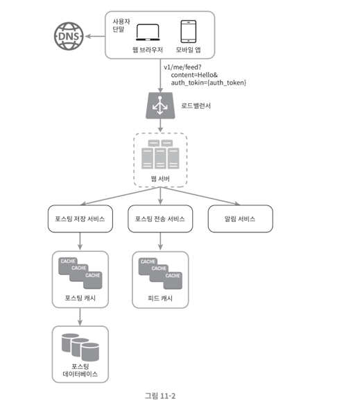
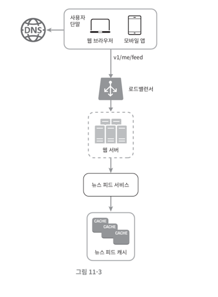
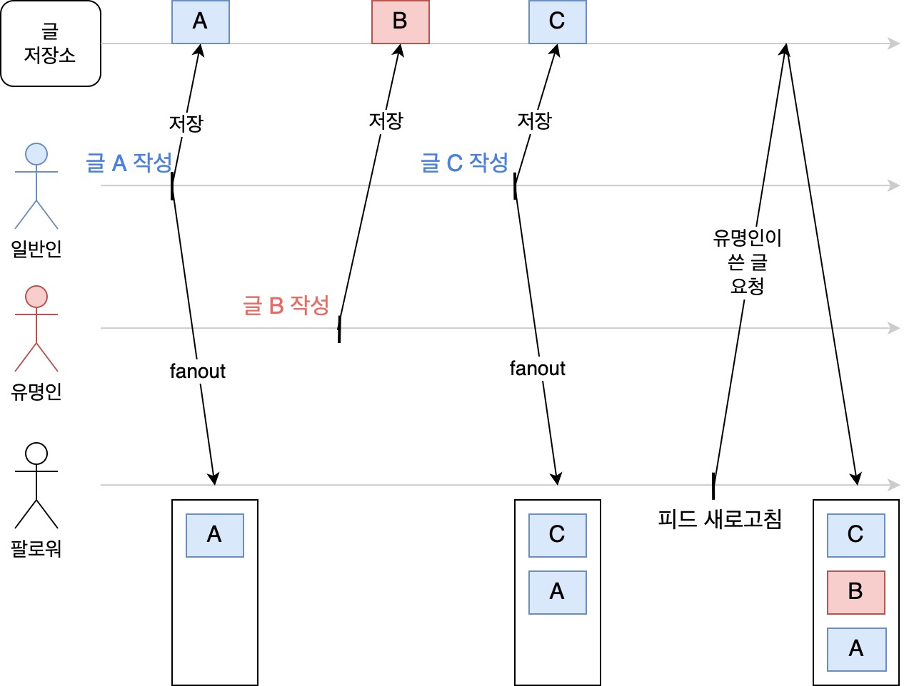

# 11장. 뉴스 피드 시스템 설계

뉴스 피드는 홈페이지 중앙에 지속적으로 업데이트되는 스토리들로 구성된다. 쉽게 말해, 페이스북이나 인스타그램 피드, 트위터 타임라인 설계와 같은 것을 말한다.

두 가지 설계안으로 뉴스 피드 시스템을 생각해보자.

1. 피드 발생(feed publishing)
    - 사용자가 스토리를 포스팅하면, 해당 데이터를 캐시와 데이터베이스에 기록
    - 새 포스팅은 친구의 뉴스 피드에도 전송
2. 뉴스 피드 생성 (news feed building)
    - 뉴스 피드는 모든 친구의 포스팅을 시간 흐름 역순으로 모아서 보여줌

### 뉴스 피드 API

- 클라이언트가 서버와 통신하기 위해 사용하는 수단
- HTTP 프로토콜 기반
- 상태 정보 업데이트, 뉴스 피드 조회, 친구 추가 등 다양한 작업 수행

**피드 발행 API**

새 스토리를 포스팅하기 위한 API

```http request
POST /v1/me/feed
Authorization: Bearer <인증 토큰>
Content-Type: application/json

{
  "content": "포스팅 내용이 포함된다."
}
```

**피드 읽기 API**

뉴스 피드를 가져오는 API

```http request
GET /v1/me/feed
Authorization: Bearer <인증 토큰>
```

### 피드 발행



사용자는 피드 발행 API(`POST /v1/me/feed`)를 통해 새 포스팅을 생성하며, 로드밸런서는 트래픽을 웹 서버들로 분산한다.

이 때 웹 서버는 HTTP 요청을 내부적으로 중계하는 역할을 담당:

- 포스팅 저장 서비스(post service): 새 포스팅을 데이터베이스 및 캐시에 저장
- 포스팅 전송 서비스(fanout service): 새 포스팅을 친구의 뉴스 피드에 푸시(push)하고 뉴스 피드 데이터를 캐시에 저장
- 알림 서비스(notification service): 친구들에게 새 포스팅이 올라왔음을 알리는 역할

### 뉴스 피드 생성

사용자가 보는 뉴스 피드는 어떻게 만들어지는지 살펴보자



사용자는 뉴스 피드 조회 API(`GET /v1/me/feed`)를 호출하여 뉴스 피드를 가져온다. 위와 마찬가지로 로드밸런서는 트래픽을 웹 서버들로 분산한다.

웹 서버는 트래픽을 뉴스 피드 서비스로 보낸다:

- 뉴스 피드 서비스(news feed service): 캐시에서 뉴스 피드를 가져오는 서비스
- 뉴스 피드 캐시(news feed cache): 뉴스 피드를 렌더링할 때 필요한 피드 ID를 캐시에 보관

## 피드 발행 흐름 상세 설계

### 웹 서버

- 클라이언트와 통신
- 인증
- 처리율 제한
- 스팸 및 유해 컨텐츠 방지를 위한 포스팅 수 제한

### 포스팅 전송(팬아웃) 서비스

> 팬아웃(fanout): 어떤 사용자의 새 포스팅을 그 사용자와 친구 관계에 있는 모든 사용자에게 전달하는 괒어

- 쓰기 시점에 팬아웃(fanout-on-write), 푸시 모델
- 읽기 시점에 팬아웃(fanout-on-read), 풀 모델

### 쓰기 시점에 팬아웃

포스팅이 완료되면 바로 해당 사용자의 캐시에 해당 포스팅을 기록하는 것을 말한다.

**장점**

- 뉴스피드가 실시간으로 갱신된다. (친구 목록에 있는 사용자에게 즉시 전송됨)
- 새 포스팅이 기록되는 순간에 뉴스 피드가 이미 갱신되어 뉴스 피드를 읽는데 드는 시간이 짧아진다.

**단점**

- 친구가 많은 사용자의 경우 친구들의 뉴스 피드를 갱신하는데 더 많은 시간이 소요될 수 있다. (= 핫키, hotkey)
- 서비스를 자주 이용하지 않는 사용자의 피드까지 갱신하여 자원 낭비

### 읽기 시점에 팬아웃

피드를 읽어야 하는 시점에 뉴스 피드를 갱신하는 요청 기반(on-demand) 모델을 말한다.

**장점**

- 비활성화된 사용자 및 거의 로그인하지 않는 사용자의 경우에는 이 모델이 유리하다.
- 데이터를 친구 각각에 푸시하는 작업이 필요없어 핫키 문제도 발생하지 않음

**단점**

- 뉴스 피드를 읽는데 많은 시간이 소요된다.

> 이 두가지 방식을 결합하여 장점은 취하고 단점은 버리는 전략을 사용할 수 있다.

### 결합한 방법

**뉴스 피드를 빠르게 가져올 수 있도록 하는 것** 이 가장 중요하다.

- 대부분의 사용자 - 푸시 모델 사용 (쓰기 시점에 팬아웃)
- 친구/팔로워가 많은 사용자 - 풀 모델 사용(읽기 시점에 팬아웃)

위의 방식을 통해 시스템 과부하를 방지한다. 또한, 안정 해시(consistent hashing)을 통해 요청과 데이터를 보다 고르게 분산하여 핫키 문제를 줄여보자.



> [트위터, 인스타그램 피드는 어떻게 만들어질까? - 대규모 시스템 설계 기초 11장](https://velog.io/@broccolism/%ED%8A%B8%EC%9C%84%ED%84%B0-%EC%9D%B8%EC%8A%A4%ED%83%80%EA%B7%B8%EB%9E%A8-%ED%94%BC%EB%93%9C%EB%8A%94-%EC%96%B4%EB%96%BB%EA%B2%8C-%EB%A7%8C%EB%93%A4%EC%96%B4%EC%A7%88%EA%B9%8C-%EB%8C%80%EA%B7%9C%EB%AA%A8-%EC%8B%9C%EC%8A%A4%ED%85%9C-%EC%84%A4%EA%B3%84-%EA%B8%B0%EC%B4%88-11%EC%9E%A5)

- 일반인이 글을 작성할 경우, 쓰기 시점에 팬아웃
- 유명인이 글을 작성할 경우, 읽기 시점에 팬아웃

이러한 방식을 통해 단점은 피하고 장점만을 취할 수 있다.

> 그래프 데이터베이스 모델(GraphQL)에 대해서 살펴보면 좋을 것 같다.

---

단순히 Rest API를 설계하고, JSON 형태로 응답하는 것에만 중점을 두었었는데 글을 쓰는 사람의 상태와 여러 환경에 따른 트레이드 오프를 생각해보게 되었다.

풀, 푸시를 결정짓는 것은 팔로워 수, 친구 수로만 한정될 수 있을지에 대해서도 궁금하다. 사실 쓰레드, 트위터 같은 곳들은 하루에 글을 20개 넘게 올리는 사람도 있는 것으로 아는데, 
이러한 경우엔 어떻게 별도로 처리를 할까? 라는 궁금증도 생겼음. 