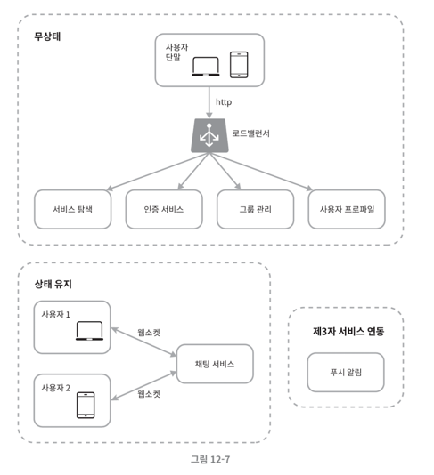

# 12장. 채팅 시스템 설계

어떤 채팅 앱을 설계하려는지 확실히 하는 것이 가장 중요하다.

- 1:1 채팅에 집중한 앱 (페이스북 메신저, 위챗, 왓츠앱)
- 그룹 채팅에 중점을 둔 업무용 앱(슬랙)
- 게임 채팅에 쓰이는 앱(디스코드)

최소한, 1:1 채팅 앱인지, 아니면 그룹 채팅 앱인지는 파악하는 편이 좋다.

## 문제 이해 및 설계 범위 확정

- 1:1, 그룹 채팅 모두 지원
- 모바일, 웹 모두 지원
- DAU 기준 5천만명 처리
- 그룹 채팅의 경우 최대 100명까지 참가
- 1:1 채팅, 그룹 채팅, 사용자 접속 상태 표시 지원
- 텍스트 메시지만 주고 받는 환경
- 메시지 길이: 100,000자 이하
- 종단간 암호화는 추후에 고려
- 채팅 이력은 영원히 보관

페이스북 메신저와 유사한 채팅 앱을 설계해보자. 

## 개략적 설계안 제시 및 동의 구하기

클라이언트와 서버의 통신 방법에 대한 기본 지식을 갖추고 있어야 한다.

- 클라이언트: 모바일 앱 / 웹 애플리케이션
- 클라이언트는 서로 직접 통신하지 안흔다.
- 각 클라이언트는 채팅 서비스와 통신한다.

여기서 채팅 서비스는 어떤 기능을 제공해야할까?

**채팅 서비스**

- 클라이언트들로부터 메시지 수신
- 메시지 수신자(recipient) 결정 및 전달
- 수신자가 접속(online) 상태가 아닌 경우 접속할 때까지 메시지 보관

클라이언트가 메시지를 송신할 때 HTTP 프로토콜로 연결한 다음에 메시지를 전송하는 방식을 사용한다. 또한, keep-alive 헤더를 사용하여 핸드셰이크 횟수를 줄일 수 있다.

하지만 메시지 수신 시나리오는 더욱 복잡하여, 서버가 연결을 만드는 것처럼 동작할 수 있도록 하기 위해서 다양한 기법들이 쓰인다. 이 기법들을 알아보자.

### 폴링

클라이언트가 주기적으로 서버에게 새 메시지가 있느냐고 물어보는 기법

- 폴링을 자주 할 수록 비용이 올라감
- 답해줄 메시지가 없는 경우 서버 자원 낭비 문제가 발생

### 롱 폴링

클라이언트가 새 메시지가 있느냐고 물어본 후, 서버가 연결을 종료하기 전까지 대기하며 종료 직전에 새 메시지를 반환하는 기법

- 클라이언트는 새 메시지가 반환되거나 타임아웃 될 때까지 서버와 연결을 유지
- 메시지를 보내는 클라이언트와 수신하는 클라이언트가 같은 채팅 서버에 접속하게 되지 않을 수도 있음
  - 로드 밸런싱을 위해 라운드 로빈 알고리즘을 사용하는 경우
- 서버 입장에서 클라이언트가 연결을 해제했는지 알 수 없음

메시지를 많이 받지 않는 클라이언트도 타임아웃이 일어날 때마다 주기적으로 서버에 다시 접속하여 비효율적

### 웹 소켓

서버가 클라이언트에게 비동기(async) 메시지를 보낼 때 가장 널리 사용되는 기법

- 클라이언트가 연결을 시작
- 연결은 영구적이며 양방향이다. 
- 처음에는 HTTP 연결 후, 특정 핸드셰이크 절차 후 웹 소켓 연결로 업그레이드
- 또한, 80, 443 포트를 사용하므로 방화벽이 있는 환경에서도 사용 가능

유의할 점은 웹소켓 연결은 영구적으로 유지되어야 하기 때문에 서버 측에서 효율적인 연결 관리가 필요하다.

### 개략적 설계안

웹 소켓을 사용한다 하더라도, 대부분의 기능은 일반적인 HTTP 상에서 구현해도 무방하다.

만약 모놀리틱 아키텍처에 해당 서비스가 운영된다고 가정한다면, 서버 한 대로 얼마나 많은 접속을 동시에 허용할 수 있을지 생각해보자.

> 무조건적으로 큰 설계가 아닌, 점차 확장시켜나가야 할 방법을 찾아보고, 서버를 어떻게 분리할 수 있을지에 대해서 고민하면 좋을 것 같다. 

**저장소**

과연 어떤 데이터베이스를 사용해야할까?

- 데이터의 유형
- 읽기/쓰기 연산의 패턴

두 가지를 잘 고려해야 한다.

채팅 시스템에서는 

1. 일반적인 데이터 (사용자 정보, 친구 목록 등) &larr; 안정성을 보장하는 RDBMS가 적합하다.
2. 고유한 데이터 (채팅 이력) &larr; 읽기/쓰기 연산 패턴을 이해해야 한다.

채팅 이력의 데이터 양은 엄청나며, 주로 최신 메시지를 읽는 연산이 많다. 또한, 검색 기능 및 특정 메시지에 접근하게 되는 일도 많다.

이러한 패턴을 고려했을 때, 키-값 저장소를 사용하여 데이터 접근 지연시간이 짧고, 인덱스가 커져 발생하는 RDBMS의 문제점을 피할 수 있다.

이 때 데이터 모델의 경우 ID를 만들 때 NoSQL 데이터베이스를 사용하는 만큼, 별도의 기본 키 생성 전략을 고려해야 한다.

앞 장에서 살펴봤던 스노플레이크 기법이나, 지역적 순서 번호 생성기 등을 사용할 수 있다.

